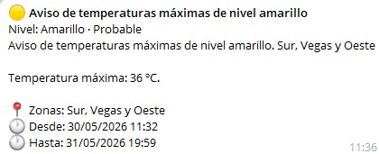
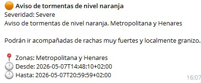

<h1 align="center">TiempoBot</h1>

<p align="center">
  
</p>

Bot de Telegram para recibir alertas meteorológicas de la **AEMET** (Agencia Estatal de Meteorología) en tiempo real. Suscríbete a tu provincia y recibe notificaciones automáticas cuando se emitan avisos.

---

## Screenshots

| Alerta amarilla | Alerta naranja |
|---|---|
|  |  |

---

## Características

- **Notificaciones automáticas** — El bot consulta la API de AEMET periódicamente y te envía alertas nuevas
- **52 provincias españolas** — Cobertura completa incluyendo Ceuta y Melilla
- **Teclado interactivo** — Selección de provincia con botones en Telegram
- **Emojis por severidad** — 🟢 Verde, 🟡 Amarillo, 🟠 Naranja, 🔴 Rojo
- **Solo alertas relevantes** — Notifica a partir de nivel amarillo, ignorando verdes
- **Deduplicación** — Nunca recibes la misma alerta dos veces
- **Limpieza automática** — Alertas antiguas purgadas tras 7 días
- **Docker ready** — Despliegue con un solo comando

---

## Tech Stack

| Capa | Tecnología | Versión |
|---|---|---|
| Lenguaje | Python | 3.12 |
| Bot Framework | python-telegram-bot | 21.3 |
| HTTP Client | httpx | 0.27.0 |
| Scheduler | APScheduler | 3.10.4 |
| Base de datos | SQLite3 | stdlib |
| Contenedor | Docker + Docker Compose | — |
| API externa | AEMET OpenData | REST (CAP v1.2) |

---

## Comandos del bot

| Comando | Descripción |
|---|---|
| `/start [provincia]` | Mensaje de bienvenida; suscripción opcional directa |
| `/suscribir <provincia>` | Suscribirse a alertas de una provincia (teclado interactivo sin argumento) |
| `/provincias` | Ver las 52 provincias disponibles |
| `/alertas` | Consultar alertas activas de tu provincia |
| `/estado` | Ver estado de tu suscripción |
| `/cancelar` | Cancelar suscripción |

---

## Variables de entorno

| Variable | Requerida | Default | Descripción |
|---|---|---|---|
| `TELEGRAM_BOT_TOKEN` | Sí | — | Token del bot desde [@BotFather](https://t.me/BotFather) |
| `AEMET_API_KEY` | Sí | — | API key desde [AEMET OpenData](https://opendata.aemet.es/) |
| `CHECK_INTERVAL_MINUTES` | No | `10` | Intervalo (minutos) entre consultas a AEMET |
| `DB_PATH` | No | `/data/users.db` | Ruta de la base de datos SQLite |

---

## Instalación y uso

### Local

```bash
# Crear entorno virtual
python -m venv .venv
source .venv/bin/activate    # Linux/Mac
# .venv\Scripts\activate     # Windows

# Instalar dependencias
pip install -r requirements.txt

# Configurar variables de entorno
cp .env.example .env
# Editar .env con tus claves

# Ejecutar
python run.py
```

### Docker

```bash
# Configurar variables de entorno
cp .env.example .env
# Editar .env con tus claves

# Construir e iniciar
docker compose up -d

# Ver logs
docker compose logs -f

# Detener
docker compose down
```

---

## Obtener credenciales

1. **Telegram Bot Token** — Habla con [@BotFather](https://t.me/BotFather) en Telegram y crea un nuevo bot
2. **AEMET API Key** — Regístrate en [AEMET OpenData](https://opendata.aemet.es/) y solicita tu clave de API

---

Hecho con ❤️ y ⚡ para ahorrar dinero y energía por [Hugo Perez-Vigo](https://github.com/Hugopvigo/PrecioLuz)
